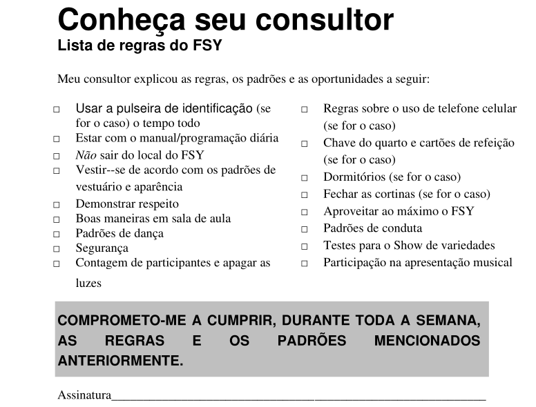
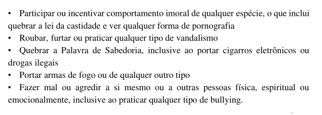

# **Conheça seu Consultor**  

## **1\. Abertura e Boas-vindas**

**Objetivo:** Criar um ambiente acolhedor e convidar o Espírito.

**O que fazer?**

* Me apresentar:
  * Falar brevemente sobre mim e sobre minhas espectativas no FSY
  * Expressar gratidão e entusiasmo por participar do FSY.

* Quebrar gelo com os jovens:
  * Aplicar uma atividade simples para conhecer melhors os jovens.

* Explicação breve do propósito do FSY:
  * Fortalecer a fé em Jesus Cristo e Seu evangelho.
  * Incentivar inclusão e experiências espirituais duradouras.

**Lembrese:**
* Demostre amor aos jovens. 
* Esteja animado. 

---

## **2\. Explicação das Expectativas e Regras**

**Objetivo:** Garantir que os jovens entendam comportamentos, normas e responsabilidades.

**O que fazer?**
1. Abrir o manual do participante na parte das regras Conheça seu consultor.

2. Explicar cada item da lista e pedir aos jovens que escrevam nome e data no final da página.

3. Explicar sobre as pulseiras dos quartos.

3. Dar um foco maior nas proibições:

**Notas:**

* Deixe claro que consequências podem levar jovens a voltar para casa mais cedo

* Incentive diálogo sobre preocupações e dúvidas.

---

## **3\. Participação Engajada**

**Objetivo:** Incentivar os jovens a se envolverem nas atividades espirituais e sociais do FSY.

**Atividades:**

* **Devocionais dos participantes**: escolher responsáveis para cada dia (2º a 5º dia)

* **Show de variedades**: Explicar como vai acontecer.

* **Programa musical**: Explicar sobre e incentivar os jovens a participarem.

* **Cristo vivo**: Explicar como vai acontecer e separar as perguntas por grupo. 

---

## **4\. Encerramento da Sessão**

**Objetivo:** Reforçar as expectativas e criar compromisso.

**Atividades:**

* Reforçar importância de respeitar regras, horários e normas de segurança

* Incentivar contato com o consultor para dúvidas ou problemas

* Lembrar jovens de preencher seus manuais e manter materiais organizados

* Explicar sobre o que vai acontecer depois

---

## **5\. Observações/Anotações**

* Ajustes de horário: \_\_\_\_\_\_\_

* Problemas ou situações especiais: \_\_\_\_\_\_\_

* Pontos de atenção: \_\_\_\_\_\_\_

